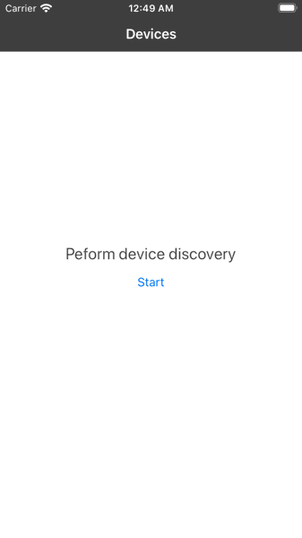

# ONVIFDiscovery
Discover ONVIF based devices on your local network

# Demo

# Run Project
To run the project:

* Clone this repository.
* Open ONVIFDiscovery.xcworkspace
* Build and run in Xcode

# License
This project is licensed under the MIT License.
